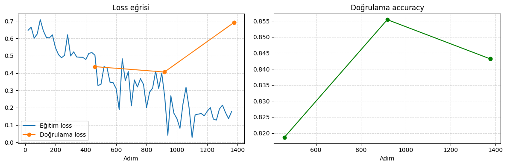

# Fine-Tuning — Hugging Face Transformers

Bu depo, Hugging Face LLM kursunun **Bölüm 3 (Fine-Tuning a Pretrained Model)** içeriğini kısa ve uygulamalı biçimde gösteren bir Jupyter Notebook (`fine_tuning_uygulama_kisa.ipynb`) içerir. Örnek görev **MRPC**: iki cümle aynı anlamda mı? Notebook, `bert-base-uncased` modelini bu görev için fine-tune eder, öğrenme eğrilerini inceler ve eğitilen modeli küçük bir araç olarak kullanır.

## İçerik

| Adım | Başlık | Açıklama |
|------|--------|----------|
| 1 | Veri İşleme (Bölüm 3/2) | MRPC veri seti, cümle çifti tokenizasyonu, dinamik padding |
| 2 | Trainer API (Bölüm 3/3) | `Trainer` ile 3 epoch fine-tuning, accuracy ve F1 metrikleri |
| 3 | Öğrenme Eğrileri (Bölüm 3/5) | Eğitim/doğrulama loss eğrileri ve doğrulama accuracy |
| 4 | Uygulama | "Bu iki cümle aynı anlamda mı?" aracı |

## Kullanılan Teknolojiler ve Model

- **Python**, **PyTorch**, **Hugging Face Transformers / Datasets**, **scikit-learn**, **Matplotlib**
- Model: `bert-base-uncased` (üzerine 2 sınıflı sınıflandırma başlığı eklenir)
- Veri: **GLUE / MRPC** (3668 eğitim, 408 doğrulama, 1725 test cümle çifti). Etiket: `1` = `equivalent` (aynı anlam), `0` = `not_equivalent`

## Kurulum ve Kullanım

```bash
pip install transformers torch datasets accelerate scikit-learn matplotlib
jupyter notebook fine_tuning_uygulama_kisa.ipynb
```

> **Not:** Colab'da **Runtime → Change runtime type → GPU** seçin. Bizim çalıştırmamızda eğitim GPU'da **2 dakika 15 saniye** sürdü (1377 adım). Model ve veri ilk çalıştırmada Hugging Face Hub'dan indirilir; daha hızlı indirme için `HF_TOKEN` tanımlanabilir.

---

## Çıktılar ve Yorum

Aşağıdaki sonuçlar Colab GPU'da alınan gerçek çalıştırmaya aittir (seed 42).

### 1. Veri İşleme

Veri seti üç bölümden oluşur: 3668 eğitim, 408 doğrulama ve 1725 test örneği. Her örnek iki cümle, bir etiket ve bir sıra numarası içerir:

```text
Örnek: {'sentence1': 'Amrozi accused his brother , whom he called " the witness " , of deliberately distorting his evidence .',
        'sentence2': 'Referring to him as only " the witness " , Amrozi accused his brother of deliberately distorting his evidence .',
        'label': 1, 'idx': 0}
```

BERT iki cümleyi tek bir dizi olarak alır; cümleler `[SEP]` ile ayrılır:

```text
Token'lar: ['[CLS]', 'this', 'is', 'the', 'first', 'sentence', '.', '[SEP]',
            'this', 'is', 'the', 'second', 'one', '.', '[SEP]']
```

Tokenizasyon `Dataset.map()` ile tüm bölümlere toplu uygulanır. Padding, `DataCollatorWithPadding` ile her batch'in kendi içindeki en uzun örneğe göre yapılır (dinamik padding).

### 2. Trainer ile Fine-Tuning

`Trainer`, optimizer (AdamW), doğrusal learning rate azalması, batch'leme ve GPU'ya taşımayı kendisi yönetir. Model yüklenirken şu rapor görülür:

```text
BertForSequenceClassification LOAD REPORT from: bert-base-uncased
cls.predictions.* , cls.seq_relationship.*  | UNEXPECTED
classifier.weight, classifier.bias          | MISSING
```

- **UNEXPECTED:** BERT'in ön eğitimde kullandığı kafalar (maskeli kelime tahmini ve sonraki cümle tahmini). Sınıflandırma görevinde kullanılmadığı için atılır, sorun değildir.
- **MISSING:** Yeni eklenen sınıflandırma başlığı. Ön eğitim kontrol noktasında olmadığı için **rastgele başlatılır** ve fine-tuning ile öğrenilir.

Epoch sonu doğrulama sonuçları:

| Epoch | Eğitim Loss | Doğrulama Loss | Accuracy | F1 |
| :---: | :---: | :---: | :---: | :---: |
| 1 | 0.5180 | 0.4368 | 0.8186 | 0.8818 |
| 2 | 0.3995 | 0.4059 | **0.8554** | **0.8985** |
| 3 | 0.1771 | **0.6924** | 0.8431 | 0.8908 |

Eğitim sonunda `trainer.evaluate()` sonucu: `eval_loss 0.6924 | accuracy 0.8431 | F1 0.8908`.

### 3. Öğrenme Eğrileri



**Gözlem: overfitting (aşırı uyum).**

- **Eğitim loss'u** sürekli düşüyor (0.52 → 0.40 → 0.18).
- **Doğrulama loss'u** ilk iki epoch'ta düşüyor (0.437 → 0.406), üçüncü epoch'ta **sert biçimde yükseliyor (0.692)**.
- **Accuracy** en yüksek değerine 2. epoch'ta (**0.8554**) ulaşıyor, 3. epoch'ta düşüyor (0.8431).

Yani 3. epoch'ta model eğitim verisini ezberlemeye başlıyor; eğitim kaybı iyileşirken görmediği veride kötüleşiyor. Eğriler tam olarak kursun anlattığı overfitting örüntüsünü gösteriyor.

Notlar:

- Son model, en iyi epoch (2) yerine **son epoch (3)** olduğu için raporlanan sonuç 0.8431'dir. Bu durumu önlemek için erken durdurma (early stopping) ya da epoch sayısını azaltma kullanılabilir.
- Eğitim loss eğrisindeki dalgalanma küçük batch boyutundan (8) gelir; her adım küçük bir örnek grubuna bakar.
- Kodda `trainer.evaluate()` eğitimden sonra bir kez daha çağrıldığı için `log_history` içinde son doğrulama kaydı iki kez bulunur (`[0.4368, 0.4059, 0.6924, 0.6924]`). Bu bir hata değil, aynı değerin tekrarıdır.

### 4. Uygulama: "Bu İki Cümle Aynı Anlamda mı?"

`paraphrase_mi(cümle1, cümle2)` fonksiyonu modelin kararını ve olasılığını döndürür.

**Doğrulama setinden örnekler (gerçek etiketli):**

```text
✔ Gerçek: equivalent      | Model: equivalent (0.998)
✔ Gerçek: not_equivalent  | Model: not_equivalent (0.998)
✘ Gerçek: not_equivalent  | Model: equivalent (0.788)
```

**Kendi yazdığımız çiftler:**

| Cümle 1 | Cümle 2 | Doğru Cevap | Model | Sonuç |
| :--- | :--- | :---: | :---: | :---: |
| The company announced a new product on Monday. | On Monday, the company unveiled a new product. | equivalent | equivalent (0.998) | ✔ |
| The weather is lovely today. | Stocks fell sharply on Monday. | not_equivalent | not_equivalent (0.997) | ✔ |
| The committee **approved** the budget. | The committee **rejected** the budget. | not_equivalent | equivalent (0.997) | ✘ |

**Yorum:** Model gerçek paraphrase'i ve alakasız çifti doğru buluyor. Ancak tek kelimenin zıt anlamlıyla değiştiği üçüncü çiftte (`approved` / `rejected`), kelimelerin neredeyse tamamı aynı olduğu için **%99.7 güvenle yanlış** cevap veriyor. Bu, ayrı çalışmamızdaki (*Kırma Testleri*, Test 4) bulguyla aynı örüntüdür: model anlam yerine kelime örtüşmesine fazla güveniyor. Yalnızca 6 örnek denendiği için bu bir istatistik değil, gösterimdir.

---

## Çıktıdaki Uyarılar (Hata Değildir)

- `HF_TOKEN` uyarısı: Hub'a kimlik doğrulaması yapılmadan istek gönderildiğini söyler; yalnızca indirme hız limitleriyle ilgilidir.
- `pip` bağımlılık çakışması (`cudf ... pyarrow`): Colab'ın kendi ortam paketleriyle ilgilidir; bu notebook'un çalışmasını etkilemedi.

## Referans Sonuç ve Tekrarlanabilirlik

Kursun kendi çalıştırmasında `Trainer` ile doğrulama **accuracy 0.8578 / F1 0.8997** olarak verilmiştir. Bizim çalıştırmamızda **accuracy 0.8431 / F1 0.8908** çıktı. Aynı seed (42) ve aynı ayarlarla, daha önce yaptığımız bağımsız bir `Trainer` çalıştırmasında da `eval_loss 0.6924`, `F1 0.8908` değerlerini birebir aldık; yani sonuç bu ortamda tekrarlanabilirdir. Kursla aradaki küçük fark, rastgele başlatılan sınıflandırma başlığından ve veri karıştırmadan kaynaklanır (kurs de bunu belirtir).

## Sınırlar

- Tek seed ve 408 örneklik doğrulama seti kullanılır; bir örnek yaklaşık %0.245 accuracy'ye denk gelir, bu yüzden küçük farklar gürültü olabilir.
- Overfitting yorumu tek çalıştırmaya dayanır; eğrinin sert yükselişi belirgin olsa da farklı seed'lerle tekrar edilmemiştir.
- Uygulama bölümündeki örnek sayısı çok azdır (6 çift); sonuçlar modelin genel doğruluğunu ölçmez.
- Elle yazılmış eğitim döngüsü, Accelerate ve learning rate karşılaştırması bu kısa sürümde yoktur.

## Ek: Kırma Testleri

Bu bölümün QA/adli bilişim tarafı ayrı bir çalışmada ele alınmıştır (*Fine-Tuning Kırma Testleri*): eğitim hattında `remove_columns`, `zero_grad()` ve learning rate gibi tek bir noktayı bozarak hatanın gürültülü çöküş mü sessiz bozulma mı ürettiği belgelenmiştir.

## Lisans

Bu proje eğitim amaçlıdır. Kullanılan model ve veri setinin lisansları Hugging Face Hub'daki ilgili sayfalarda belirtilmiştir.
